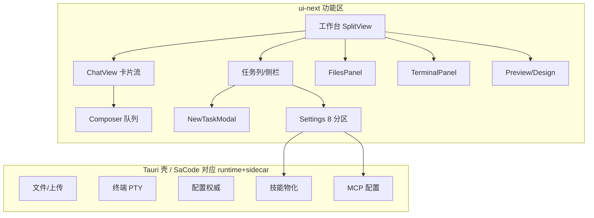
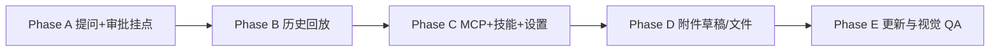

# Desktop 对齐 MonkeyCode：差距分析与实施计划

> 参考：MonkeyCode desktop（`chaitin/MonkeyCode`，commit 以 `desktop/` + `ui-next/` 为准）。
> 本文按 **交互粒度** 对齐，不抄其 AGPL 代码与视觉资产。
> 基线：本仓 `interfaces/desktop`（Vue 3 + TDesign + Tauri 2）+ `runtime` daemon。
> 日期：2026-09-29

## 状态速览（2026-09-29 收尾）

| 阶段 | 内容 | 状态 |
| --- | --- | --- |
| UI 契约 | 工作台壳、度量、信息安放 | ✅ 见 [layout-contract](./desktop-layout-contract.md) |
| P0-1 | 提问应答（AskCard + `/task/:id/answer`） | ✅ |
| P0-2 | 审批卡挂点（旧 UI；新壳以 frames 重建） | ✅ |
| P0-3 | 历史回放 `desktop_frames` | ✅ |
| P1-1 | MCP 管理 | ✅ |
| P1-2 | 技能管理（用户/项目目录） | ✅ |
| P2-1 | 外部附件 | ✅ |
| P2-2 | 输入草稿持久化 | ✅ |
| P2-5 | 文件树懒加载 | ✅ |
| D3 | 上下文用量真值 | ✅（按 200k 估 %） |
| 面板 | 文件 / 终端 / 预览格内侧板 | ✅ |
| P3 | 自动更新 / 下载坞 / VT / 预览发现 | 未做 |

验收步骤见 [desktop-integration-acceptance](./desktop-integration-acceptance.md)。
壳开发说明见 [interfaces/desktop/README.md](../../interfaces/desktop/README.md)。

---

## 0. 事实校正（先读）

对旧审计中与当前代码不符的三条做修正，避免后续按错误前提施工：

| 旧结论 | 当前事实 | 依据 |
| --- | --- | --- |
| 「审批卡只在空会话渲染」 | **已部分修复**：`conversation.ts` 在有消息时也会追加 `approvalNodes`（`[...messageNodes, ...approvalNodes]`）。剩余问题是卡片**堆在消息流末尾**，未按 `task_id` 插入对应轮次；提问卡无挂点；审批历史不回放 | `interfaces/desktop/src/app/conversation.ts:65-74` |
| 「全仓无 MCP」 | **runtime 已有完整 MCP 栈**：`McpConfigStore`（`.sacode/mcp.json` 合并读写）、stdio/http client、`list_tools`/`inspect`/`call_tool`。缺的是 **daemon HTTP CRUD + 设置页管理分区** | `runtime/src/mcp/mod.rs`、`runtime/src/lib.rs` 导出 |
| 「技能只有选择器」 | **runtime 已有 `SkillRegistry`**（Builtin/User/Project/Workspace 四源、list/save/delete）+ Skill Hub（搜索/下载/上传）。缺的是 **管理 UI、导入、默认启用、按会话启用集** | `runtime/src/skills/mod.rs`、`skills/hub.rs` |

另外：Codex 提到的隔离工作树 `C:\Users\jingg\.codex\worktrees\desktop-monkeycode-parity` **当前为空目录**（仅剩 `.codex-worktree-name`）。主仓已有对应提交（`a92f968` 对齐工作台、`349462a` 设置左导航等），未合入部分需按本清单重做或从 git 历史找回，不要假设工作树仍在。

---

## 1. MonkeyCode Desktop 功能地图

MonkeyCode 是 **Rust/Tauri 壳 + React ui-next + ohmyagent 子进程引擎**。与 SaCode 可对齐的是 **页面交互面**；账号云、装机遥测、浏览器扩展桥、WSL 不在本计划默认范围。



### 1.1 设置分区（MonkeyCode `SettingsSection`）

| 分区 | MonkeyCode | SaCode 现状 | 差距 |
| --- | --- | --- | --- |
| general | 通用/外观/声音/背景 | `general` + `appearance` | 语义可映射，需合并叙事 |
| account | 登录/用量/服务地址/Basic Auth/TLS | `account` 仅登录轮询 | **缺服务地址、Basic Auth、TLS、模型请求地址** |
| models | 模型 CRUD、每模型凭据、thinking、context_window | `execution` 内模型管理 | 可映射，字段需对齐（max_output/thinking 形） |
| **mcp** | server 增删改、type(http/stdio)、headers/env、启用停用 | **无分区** | **P1 缺口** |
| **skills** | 列表、新建、导入 zip/目录、默认启用、批量导入、恢复 | **仅默认技能下拉** | **P1 缺口** |
| browser | 浏览器扩展配对 | 无 | 范围外 |
| env | WSL / 运行环境 | `services` 部分覆盖 | 语义对齐即可 |
| about | 版本/更新 | `about` 无更新 | 缺更新入口 |

SaCode 另有 MonkeyCode 没有的：`project`、`git`、`security`、`hooks`、`import`——**保留，不删**。

### 1.2 会话卡片（ChatView）

MonkeyCode 卡片族：`AskCard`、`PermCard`、`ToolCard`、`FindingsCard`、`BackgroundAgentResultCard`、`DesignTemplateSelectionCard` + `OutlineNav` + `DetailModal` + timeline 窗口化（`useTimelineWindow`/`heightIndex`）。

SaCode 现有：message-bubble、tool-card、thinking-block、approval-card、timeline-rail。缺 **Ask 卡、Findings/子代理结果卡、Detail 详情弹层、历史窗口化**。

### 1.3 其它面板

| 面板 | MonkeyCode | SaCode |
| --- | --- | --- |
| Files | 可调宽树+预览、CodeView、Diff、Changes、ApplyPatch | 垂直堆叠树+只读预览（≤100KiB）+diff |
| Terminal | 终端面板 + termStore | PTY 已通，缺 VT 仿真/搜索 |
| Preview | dev-server 发现 + 浏览器控件 | 手填 HTTP(S) URL + reload |
| Downloads | DownloadsDock | 无 UI |
| Todo | TodoSection | **已排除** |
| Cloud | CloudTask* 全套 | **已排除** |
| Update | useUpdate 节流检查 | 无 |
| Pet/Sound | 桌宠+提示音 | 无（可不做） |

---

## 2. SaCode 当前已齐平（勿重复投入）

- 嵌套分屏 / 拖动缩放 / 最大化 / 交换 / 关闭 + 按工作区持久化：`split-layout.ts`（`split-tree.ts`/`split-slots.ts` 仍是未接入草稿）
- 各分屏独立输入草稿（**仅内存**）
- 发送队列：排队/编辑/排序/删除/自动续投/失败重试 + 本地按工作区持久化
- 原生 PTY 多终端 + 按键直传 + Ctrl+C/粘贴 + 尺寸同步
- 文件树 + 搜索 + 鉴权只读文本预览 + 变更 diff 渲染
- 侧栏归档/恢复/重命名/拖拽/未读（本地）
- 审批卡渲染与 allow/deny（按 task_id 解析）
- 设置左分类 + 右侧独立滚动（`349462a`）
- SaDesign 设计工作台（MonkeyCode 无对应，属 SaCode 优势，保留）

---

## 3. 差距清单（按优先级）

### P0 — 交互闭环（不做则任务会卡死或不可回看）

#### P0-1 提问应答闭环（阻塞 `interaction.ask`）

- **现状**：`interaction.ask` 返回 `pending_question`；daemon **无** `/task/:id/answer` 或 resume 路由。UI 无 Ask 卡。
- **MonkeyCode**：`AskCard` + `reply-question` 帧 + 驱动恢复。
- **要做**：
  1. **runtime**：`POST /task/:id/answer`（body: `{ question_id?, answer | choice_index | text }`）；`WaitingForUser` 状态可恢复；`GET /task/:id/approvals` 同步暴露 pending question。
  2. **kernel**：`interaction.ask` 执行路径支持外部注入答案后继续工具循环（或拆成 ask → suspend → resume）。
  3. **desktop UI**：`components/ask-card.ts`，在 timeline 中按轮次渲染；提交答案后刷新任务。
- **验收**：桌面发起会触发 `interaction.ask` 的任务 → 出现提问卡 → 输入/选择后任务继续 → 重启后该轮仍可见提问与答案。

#### P0-2 审批/提问卡按轮次挂载

- **现状**：审批卡追加在整条 timeline **末尾**，多任务/多轮时归属不清；提问卡无。
- **要做**：`conversationMessages` 输出统一 `TimelineItem` 流时，把 `approvalsByTask` / `pendingQuestionsByTask` **按 `task_id` 插入该轮 user 与 assistant 之间**（或该轮末）；空会话与非空会话走同一挂点。
- **验收**：同一 pane 内两轮任务先后触发审批，两张卡分别贴在各自轮次下；另一 pane 的任务审批仍正确路由。

#### P0-3 历史回放物化（工具过程/审批/计划/子代理）

- **现状**：`DesktopConversationTurn` 只有 `prompt/created_at/status/output/error`（`client-core/daemon-client.ts:88-95`；`desktop_conversations.rs:110-112`）。工具帧、审批、计划、子代理依赖**当次进程内存 timeline**，重启即丢。
- **MonkeyCode 方案**（可借鉴契约，不抄代码）：
  - journal 落盘（一 token 一帧）
  - 轮末折叠成一行（`fold`：相邻同类合并，usage/plan 只留最后）
  - `session_open` 返回尾部窗口 `{frames, cursor, has_more}`；更早按 cursor 分页
  - 大字段超限留 `_meta` 指针，展开时按 seq 回读
- **SaCode 落地建议**（贴合现有 store）：
  1. 扩展 `desktop_turns` 或旁路表 `desktop_frames(task_id, seq, kind, payload_json)`；
  2. 消费 `SessionEventLog` / task 事件流，轮末写入折叠帧；
  3. `GET /api/desktop/conversations/:id` 返回 `turns[]` + 每 turn 的 `frames[]`（或 `frames_url` + cursor）；
  4. UI 重开时用 frames 重建 tool-card/approval/plan/subagent，而不是只拼 prompt/output。
- **验收**：跑一轮含工具+审批的任务 → 退出应用 → 重开 → 卡片粒度与在线时一致（允许折叠为摘要态）。

### P1 — 管理面（设置/MCP/技能）

#### P1-1 MCP 管理分区

- **前置（已满足）**：`McpConfigStore` 可 list/upsert/delete；`inspect_server`/`list_tools` 可探活。
- **要做**：
  1. **daemon**：`GET/PUT/DELETE /api/mcp/servers`、`POST /api/mcp/servers/:name/test`（返回 tools/errors）；写回 `.sacode/mcp.json` 或项目配置。
  2. **设置页**：新 section `mcp`——列表、启用/停用、http/stdio 表单（url/command/args/headers/env）、探活按钮、保存/重置。
  3. **生效策略**（对齐 MonkeyCode「空闲重启刷新工具集」）：保存后提示「需空闲任务后刷新」；或 daemon 重载 MCP 注册表（若运行时支持热加载则直接热更）。
- **验收**：设置里添加一个 stdio MCP → 探活列出 tools → 新任务工具列表可见 → 停用后不再注入。
- **注意**：MonkeyCode 的停用字段在 `extra.disabled`，SaCode 应用配置层显式 `enabled: bool`，避免和引擎约定耦合。

#### P1-2 技能管理

- **前置（已满足）**：`SkillRegistry` 四源扫描 + Skill Hub API。
- **要做**：
  1. **daemon**：`GET /api/skills`、`PUT /api/skills/:name`、`DELETE /api/skills/:name`、`POST /api/skills/import`（zip/目录）、`PUT /api/skills/:name/default`。
  2. **设置页**：`skills` 分区——列表（来源徽标）、新建（模板）、编辑 prompt、删除、导入、默认启用开关。
  3. **composer**：由单选升级为可多选（对齐 MonkeyCode「按会话启用集」）；`create_task` 的 `skill` 字段扩为 `skills: string[]`（兼容旧单值）。
  4. **默认规则**：Builtin 默认集 + 用户技能默认启用；存储放 `~/.sacode/skills-defaults.json` 或配置表，**不进**会话权威配置。
- **验收**：导入 zip → 设置可见 → 新任务可选中 → 任务 prompt 注入生效 → 默认启用后新建任务自动带上。
- **形态（已定）**：用户/项目目录；不随包分发内置技能库（P3 可选）。内置默认技能可继续走 `SkillRegistry::ensure_defaults` 落到 workspace 目录。

#### P1-3 设置分区语义对齐

- `services` → 「运行环境」（shell 默认、侧车、daemon 地址）。
- `account` 补：服务地址、Basic Auth、TLS 校验、模型请求地址（私有化部署常用）。
- 新增「更新」入口（可先只做「检查更新」占位，见 P3）。
- 保存条：models/mcp 走全量草稿保存；skills 即时读写不进草稿（对齐 MonkeyCode）。

### P2 — 输入与数据完整性

| ID | 项 | 要点 |
| --- | --- | --- |
| P2-1 | **外部附件** | 文件/图片上传到 `<workdir>/.sacode/uploads/`，composer 显示 chip；拖放/粘贴；消息里以相对路径引用。Tauri `uploads.rs` 或 daemon `POST /workspace/uploads` |
| P2-2 | **草稿持久化** | `InputAreaState` 按 `conversationId`/`paneId` 写 localStorage 或 sidecar，重启恢复 |
| P2-3 | **上下文用量条** | 消费 `usage_update` / snapshot，composer 显示 token 用量 |
| P2-4 | **单次任务思考档** | 新任务/会话可覆盖 thinking effort（依赖模型 caps） |
| P2-5 | **文件树懒加载** | 替换 `WorkspaceScanner` 1000/深度5 为按目录分页 `GET /workspace/list?path=`；树/预览可拖宽 |
| P2-6 | **预览类型** | 图片/Markdown/JSON 语法高亮；二进制元信息 |
| P2-7 | **拖拽换位** | 分屏标题拖拽交换、任务拖入指定 pane |
| P2-8 | **发送中断恢复** | 关窗前未确认投递的消息标记 `uncertain`，显式重试（已有部分逻辑，补 UI 提示） |

### P3 — 产品化（先定定位再做）

| ID | 项 | 依赖 |
| --- | --- | --- |
| P3-1 | 自动更新 | 发布签名、更新源、`tauri-plugin-updater` |
| P3-2 | 下载管理坞 | 下载事件管道 + Dock UI |
| P3-3 | 终端 VT 仿真 | `xterm.js` 或等价；全文搜索 |
| P3-4 | 预览 dev-server 自动发现 | 扫描常用端口 / package.json scripts |
| P3-5 | 技能随包分发 | 打包 resources + 版本钉死 |
| P3-6 | 宽屏逐页视觉比对 | 需原生 Tauri 窗口截图对照 |

### 明确范围外（维持既有决定）

云端任务、浏览器扩展桥、装机遥测、WSL 运行环境、桌宠/提示音、临时会话与待办分组、跨项目任务装载（若后续要「多项目一屏」，单独立项，不塞进本轮）。

---

## 4. 分阶段实施计划

### Phase A — 任务可暂停可恢复（P0-1 + P0-2）

| 步骤 | 位置 | 产出 |
| --- | --- | --- |
| A1 | `runtime/src/tools/interaction/`、`kernel` 执行循环 | ask 可挂起、可注入答案恢复 |
| A2 | `runtime/src/daemon/` | `POST /task/:id/answer` + pending question 查询 |
| A3 | `interfaces/client-core` | `answerTaskQuestion` API |
| A4 | `interfaces/desktop/src/components/ask-card.ts` + `conversation.ts` | 提问卡；审批/提问按轮次插入 |
| A5 | 测试 | daemon 闭环测试 + desktop conversation 测试 |

**验收**：见 P0-1/P0-2。  
**预估**：runtime 1.5d + UI 1d + 测试 0.5d。

### Phase B — 历史回放（P0-3）

| 步骤 | 位置 | 产出 |
| --- | --- | --- |
| B1 | `runtime/src/store/` | `desktop_frames` 表 + 轮末折叠写入 |
| B2 | 事件订阅 | 从 task event / SessionEventLog 投影帧 |
| B3 | `desktop_conversations.rs` | 详情 API 带 frames 或 cursor 分页 |
| B4 | `service.ts` + `conversation.ts` | 重开重建卡片；长会话窗口化 |
| B5 | 测试 | 重启回放等价性（折叠前后渲染一致） |

**验收**：见 P0-3。  
**预估**：store+API 2d + UI 1.5d + 测试 1d。

### Phase C — MCP + 技能管理（P1-1 + P1-2 + P1-3）

| 步骤 | 位置 | 产出 |
| --- | --- | --- |
| C1 | daemon MCP routes | CRUD + test |
| C2 | daemon skills routes | list/save/delete/import/default |
| C3 | `settings.ts` | `mcp`、`skills` 分区 + 保存策略 |
| C4 | `input-area.ts` / `new-task-dialog.ts` | 技能多选 + 附件入口预留 |
| C5 | 设置语义 | account 字段、运行环境、更新入口占位 |

**验收**：见 P1。  
**预估**：API 1.5d + 设置 UI 2d + composer 1d。

### Phase D — 输入与文件体验（P2）

按 P2-1 → P2-2 → P2-3 → P2-5 优先（附件/草稿影响日常；懒加载影响大仓）。  
**预估**：附件 1.5d、草稿 0.5d、用量条 0.5d、懒加载+可调宽 1.5d。

### Phase E — 产品化与视觉 QA（P3 + 验收）

- 更新/下载/VT/dev-server 发现按产品定位取舍。
- 原生宽窗逐页截图对照 MonkeyCode（布局密度、卡片层级、设置分区）。
- 补 E2E：提问闭环、回放、MCP 注入、技能导入。

---

## 5. 建议执行顺序（汇总）



1. **Phase A**（P0-1/P0-2）— 不做则任务一 ask 就死
2. **Phase B**（P0-3）— 信任与可审计
3. **Phase C**（P1）— 管理面对齐 MonkeyCode 设置
4. **Phase D**（P2）— 日常手感
5. **Phase E**（P3）— 发布就绪

---

## 6. 已定决策（2026-09-29）

| # | 决策 | 结论 |
| --- | --- | --- |
| 1 | MCP 管理 | **纳入本轮**：daemon CRUD + 设置页 MCP 分区（增删改、启停、探活） |
| 2 | 技能库形态 | **用户/项目目录**：设置页增删改 + 导入 zip/目录 + 默认启用；**不**随包分发内置技能库（放 P3 可选） |
| 3 | 自动更新 / 下载坞 | 本轮不做，等发布签名定案 |
| 4 | 临时会话/待办/云端/浏览器桥/WSL | 维持排除 |

Phase C 按上述 1、2 直接开工；A/B 不依赖这些决策。

---

## 7. 验证基线

每阶段合并前至少：

```text
cargo test --workspace
cargo test -p sacode-runtime
cd interfaces/desktop && npm test && npm run build   # 或项目等价脚本
git diff --check
```

涉及打包/发布时再跑 `node scripts/check-release.js`。

视觉验收（Phase E）：Windows 宽屏 Tauri 原生窗，对照 MonkeyCode 同尺寸截图检查——工作台分栏、会话卡片密度、设置分区结构、文件面板比例。

---

## 8. 与 Codex 进度的衔接

Codex 描述中「已在主仓验证」的能力（分屏、队列、PTY、文件树、归档、设置左导航）**视为已完成**，对应本文 §2。  
其「未完成」项与本文映射：

| Codex 未完成项 | 本文条目 |
| --- | --- |
| 分屏交换（工作树版） | P2-7（主仓已有菜单交换，拖拽待补） |
| 会话归档与未读 | 已在主仓；跨设备同步仍排除 |
| 附件与发送队列 | 队列已齐；附件 = P2-1 |
| 对话卡片/设置管理 | P0-2/P0-3 + P1 |
| 审批/提问 | P0-1/P0-2 |
| 历史回放 | P0-3 |
| MCP/技能管理 | P1-1/P1-2 |
