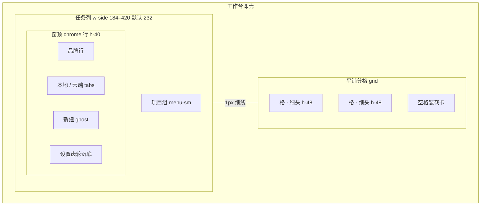

# Desktop 前端页面对齐规格（Layout Parity Spec）

> 目标：把 SaCode 桌面端从「功能可用」对齐到 MonkeyCode 的 **页面结构 / 组件语汇 / 密度** 颗粒度。
> **技术栈（2026-09-29 定案）：Vue 3 + TypeScript + Vite + TDesign（`tdesign-vue-next` + `tdesign-icons-vue-next`），壳仍为 Tauri 2。**
> 不引入 React / Tailwind / daisyUI；不拷 MonkeyCode 源码与视觉资产。TDesign 负责控件皮相，布局契约负责格子与密度。
> 功能清单见 [desktop-monkeycode-parity.md](plan-desktop-monkeycode-parity.md)；本文只管 **长什么样、格子怎么切、用什么组件栈长出来**。
> 权威参考：MonkeyCode `desktop/ui-next/LAYOUT.md`（仅作度量与信息架构权威）。
> 日期：2026-09-29

---

## 0.5 技术栈定案（2026-09-29）

| 层 | 选型 | 说明 |
| --- | --- | --- |
| 壳 | Tauri 2 (Rust) | 不变：PTY / sidecar / 原生文件 |
| 前端框架 | **Vue 3** (`<script setup>` + TS) | 替换现有 `el()` 手写 DOM |
| 构建 | **Vite** | 已有，加 `@vitejs/plugin-vue` |
| 组件库 | **TDesign** `tdesign-vue-next` + `tdesign-icons-vue-next` | 腾讯 TDesign；控件皮相 |
| 语言 | TypeScript（strict） | `vue-tsc` 过类型 |
| 状态 | Pinia 或轻量 composables | 对接 `client-core` daemon |
| 样式 | TDesign 主题变量 + `layout-contract.css` | 品牌暖橙映射 `--td-brand-color` |
| 测试 | 现有 node:test / 后续 Vitest | 组件可加 Vitest + Vue Test Utils |

依赖安装（`interfaces/desktop`）：

```bash
npm i vue tdesign-vue-next tdesign-icons-vue-next
npm i -D @vitejs/plugin-vue vue-tsc vitest @vue/test-utils
```

---

## 0. 为什么现在「颗粒度没法接受」

不是缺功能，是 **壳形态和度量体系就不在一个量级**：

| 维度 | MonkeyCode（目标） | SaCode 现状 | 差距性质 |
| --- | --- | --- | --- |
| 壳形态 | **工作台即壳**：任务列 + 平铺分格，无 rail/侧栏/状态栏 | 侧栏 260px + 工作区 + 可选上下文 360px + 底栏 28px | **结构代差**（对齐的是 MonkeyCode 已退役的旧壳） |
| 布局契约 | `LAYOUT.md` 逐像素定案，改格子必须改契约 | 无契约，CSS 按页面各自长 | **过程代差** |
| 高度体系 | 28 / 40 / 52 / 48 四档贯通 | 44 topbar / 28 statusbar / 各页自定 | 度量不对表 |
| 正文列宽 | `.chat-measure` = `min(64rem, max(48rem, 92%))`，消息与 composer **共用** | `--content-max-width: 760px` + `--composer-max-width: 780px` **两套数** | 中线会错开 |
| 分格皮肤 | 白底通栏 + 1px 细线 + 焦点标题下划线 | pane + mode 色头 + divider 6px | 视觉语汇不同 |
| 列表密度 | menu-sm **12px / 行距 4px**，缩进每级 **+20px** | 侧栏行 28–48px 混用，字号 12/14/9 混用 | 密度无档位 |
| 信息安放 | 「每类信息只有一个法定位置」表 | 同类信息散在 top-bar / status-bar / pane-header | 信息架构不齐 |
| 组件收口 | `listKit` 一套件，三列表共用 | 各列表各写 | 组件粒度粗 |
| 图标/皮相 | Tabler `stroke=1.75` + daisyUI 官方形态 | 自绘 CSS + emoji/字符 | 皮相不齐 |

**结论**：功能补完不够。要先把 **壳与度量** 对到 MonkeyCode 契约，再谈卡片细节。否则每补一个功能都长在错误的格子里。

---

## 1. 目标壳形态（必须先定的结构）



### 1.1 度量表（对齐 MonkeyCode LAYOUT）

| 令牌 | 值 | 用途 | SaCode 现值 | 动作 |
| --- | --- | --- | --- | --- |
| `--chrome-h` | 28px（Win）/ 0（mac 灯） | 窗框条 | 无自绘标题条 | 视 Tauri 装饰而定，保留/映射 |
| `--chrome-row` | **40px** | 任务列顶行 / 列收起顶条 / 设置页头 | `--topbar-height: 44` | **改 40** |
| `--header-h` | **52px** | 覆盖视图头（旧三列时代） | — | 工作台时代用 48 |
| `--pane-head-h` | **48px** | 分格细头（主头） | pane-header 44 | **改 48** |
| `--list-row` | **12px 字 / 4px 距** | 任务列表 menu-sm | 28–48px 行高混用 | **收成一档** |
| `--list-indent` | **+20px / 级** | 组头图标 12 + gap 8 | 不统一 | **钉 20 网格** |
| `--w-side` | **184–420，缺省 232**，可拖 | 任务列 | `--sidebar-width: 260` | **改 232 钳制** |
| `--chat-measure` | `min(64rem, max(48rem, 92%))` | 消息流 + composer **共用** | 760 / 780 两套 | **合成一条** |
| 分隔线 | **1px** `base-300` | 格与格、列与格 | divider **6px** | **改 1px + 8px 透明把手** |
| 焦点格 | 标题 **primary 下划线**（绝对定位悬挂） | pane-active | mode 色染头 | **改下划线** |

### 1.2 信息安放（从 MonkeyCode §3 照搬语义）

| 信息 | 法定位置 | 禁止 |
| --- | --- | --- |
| 视图标题 / 路径 | 分格细头左侧 | 头部以外再写一份 |
| 视图动作（文件/终端/⋯/关闭） | 分格细头右侧簇 | 格内再出一套钮 |
| 运行态（思考/执行/停止） | composer **上方**状态行 | 细头、状态栏 |
| 模型 / 思考档 / 模式 | composer 底部集群 **左** | 细头 |
| 上下文用量 % | composer 底部集群 **右** | 状态栏 |
| 任务状态 | 任务列行尾状态点 | 细头文字、独立列 |
| 引擎/连接错误 | 全局横幅或细头下内嵌条 | 塞进消息流混排 |
| 下载 / 更新 | 右下 dock / 列底条 | 细头 |

**落地动作**：废弃底部 status-bar 作为信息容器（可留极窄系统条或删除）；top-bar 动作全部迁入分格细头。

---

## 2. 页面骨架对照（逐页）

### 2.1 工作台主界面（壳）

**目标（MonkeyCode §0/§4）**

```
┌─ chrome 40 ──────────────────────────────────────────────┐
│ 品牌行 · tabs 本地|云端 · …… · ☰ · [新建 ghost]           │
├─ 任务列 232 ─┬─1px─┬─ 分格 grid（白底通栏）──────────────┤
│ 项目组        │     │ ┌─ 细头 48 ──[动作簇]─┐┌─ 细头 ─┐ │
│  · 任务行     │     │ │ 会话 / 创建页      ││ …     │ │
│  · 任务行     │     │ │ chat-measure 居中  ││       │ │
│  「已归档」   │     │ │ composer 无上边线  ││       │ │
│ …             │     │ └────────────────────┘└───────┘ │
├───────────────┤     │ 空格 = 装载卡（本地|云端 tab）     │
│ ⚙ 设置 沉底   │     │                                  │
└───────────────┴─────┴──────────────────────────────────┘
```

**现状**

```
┌─ sidebar 260 ─┬─ work-area ────────────────┬─ context 360 ─┐
│ 会话列表      │ pane-header 44 (mode 色)   │ 文件/变更/    │
│ 新建/归档…    │ conversation                │ 终端/预览     │
│               │ composer 780                │ （可关）      │
├───────────────┴───────────────────────────┴───────────────┤
│ status-bar 28                                            │
└──────────────────────────────────────────────────────────┘
```

**改造清单（结构级）**

1. **去掉 rail/侧栏双层导航** → 任务列双 tab（本地项目 / 云端任务，云端可后置为禁用 tab）。
2. **去掉独立 context-panel 列** → 文件/终端/预览改 **格内抽屉 / 细头动作**（MonkeyCode FilesDrawer pane 变体）。
3. **去掉 status-bar** → 信息按 §1.2 迁走。
4. **分格皮肤** → 白底、1px 线、焦点标题下划线；mode 不再染整条头。
5. **新建即新格** → 创建页是 pane，不是整页/dialog 双形态。
6. **空格装载卡** → 本地项目列表（与任务列同序）+ 横向 tab。

### 2.2 会话格（ChatView pane）

**目标骨架**

```
细头 48: [状态点][标题 双击改名] ······ [插槽][文件][⋯][✕]
├─ (连接条 可选)
├─ 消息流  .chat-measure 居中  滚动: overflow-y + x hidden + gutter stable
│    user / assistant / tool-card / perm / ask / plan …
├─ plan 面板（composer 上方，可收）
├─ 状态行（运行态）
└─ composer  无上边线
     [附件 chip][模式/模型/思考][输入]  ……  [用量%][发送]
```

**现状差距**

| 项 | 目标 | 现状 | 动作 |
| --- | --- | --- | --- |
| 列宽 | chat-measure 一条 | content 760 / composer 780 | **合并变量，消息与 composer 同源** |
| 细头 | 48px 白底 + 动作簇 | 44px + mode 色 + 分散钮 | 重做 pane-header |
| 消息卡 | 不突破 measure | 部分卡自宽 | 钳制 |
| composer | 无上边线；控件左/用量右 | 有 wrap 边界；控件布局自有 | 重排底部集群 |
| 大纲 | 左缘浮轨（格内） | timeline-rail | 保留，改为格内浮轨 |
| 审批/提问卡 | 插在轮次内 | 末尾追加 | 见功能 P0-2 |

### 2.3 任务列表（原侧栏）

**目标**：`listKit` 一套件——组头「区块标签」+ 安静行（行首 12px 图标槽 / 主文案 / 行尾状态点）。

| 规则 | 目标值 | 现状问题 |
| --- | --- | --- |
| 行高/字号 | 12px 字，行距 4px | 28/30/32/36/40/48 混用 |
| 缩进 | 每级 +20px，行底满宽 | padding 不一 |
| 选中 | 仅 `menu-active` 淡填充 | 可能与 attention 底色撞车 |
| 未读/待处理 | **2px warning 竖条** + 行尾点，**不用整行底色** | 需核对 |
| 归档行 | 降色 `/55` | 需核对 |
| 组间空白 | **无**（靠缩进+小标签） | 若有大 margin 要拆 |
| 折叠 | 条件卸载，状态落盘 | 部分 details 原生隐藏 |
| hover 显隐 | `invisible→visible`，禁止 `hidden→flex` | 审查所有 hover 钮 |

### 2.4 设置

**目标**：视图级头（40px chrome 语汇）+ 居中内容列 `max-w-2xl`；左分类导航右侧内容（已有左导航，保留）；分区语义对齐 MonkeyCode 8 项（见功能 P1-3）。

差距主要是 **密度与控件形态**：对齐 40px 行、统一 field 高度、保存条固定底栏。

### 2.5 文件 / 终端 / 预览

| 面板 | 目标 | 现状 | 动作 |
| --- | --- | --- | --- |
| 文件 | 树 \| 预览 **左右可拖** | 上下堆叠 | 改双栏，把手 8px |
| 预览 | 文本 + 图 + 代码高亮 | 仅文本 100KiB | 分类型渲染 |
| 终端 | 格内深色岛 + xterm | 行式输出 + 键直传 | P3 VT；先保证尺寸/皮相 |
| 预览 URL | 细头/面板内 | 独立 tab 条 | 并入文件抽屉或细头动作 |

### 2.6 新建任务

**目标**：格内创建页（唯一形态）——h-40 非拖拽页头、目录/提示词/模型/技能/附件、双 tab 本地|云端。

**现状**：dialog + page 双形态。**收敛为 pane 形态**，dialog 退役或仅作快捷入口最终进格。

---

## 3. 组件与皮相对齐（Vue 3 + TDesign 实现）

**实现落点：`interfaces/desktop` 升级为 Vue 3 SFC + TDesign；`@cherishron/sacode-client-core` 与 Tauri sidecar 契约不动。禁止 React / Tailwind / daisyUI / 拷贝 MonkeyCode 组件源码。**

| 类别 | MonkeyCode 语义（只抄契约） | TDesign / Vue 动作 |
| --- | --- | --- |
| 列表行 | menu-sm 12px/4px + listKit | `t-list` / `t-menu` + 自研 `ListRow`（状态点槽、attention 竖条、归档降色）；缩进 +20px |
| 分组折叠 | 区块标签 + 条件卸载 | `t-collapse` 或 `details` 包 `GroupLabel`；状态落 localStorage |
| Tabs | 白 pill、无图标 nowrap | `t-tabs` variant="card"/`t-radio-group` + 自定义 pill；任务列本地/云端 |
| 按钮 | ghost 方钮为主 | `t-button` theme="default" variant="text" + `t-icon`；chrome 不落大色块 |
| 图标 | 12 / 13–14 / 20 三档 | `tdesign-icons-vue-next`，尺寸对齐三档；禁止 emoji |
| 输入/表单 | composer、设置表单 | `t-textarea` / `t-select` / `t-input` / `t-switch` / `t-form` |
| 菜单 | 右键、⋯ 操作 | `t-dropdown` / 自研 context menu（TDesign 无全局右键时） |
| 抽屉/弹层 | 文件抽屉、设置 | `t-drawer` / `t-dialog` / `t-popup` |
| 消息/卡片 | tool/perm/ask 卡 | 自研 Vue 组件（`MessageBubble`、`ToolCard`…），皮肤走 TDesign token |
| 主题 | 结构层 base 档 | TDesign **主题变量** + SaCode 暖色 accent（`--td-brand-color` 映射 `--accent`） |
| 字阶/密度 | 列表 12、正文 14 | 覆盖 TDesign `--td-font-size-*` 对齐契约；列表 `size="small"` |

> TDesign 是 **控件库**，不是布局引擎。壳网格、`--chat-measure`、任务列宽度、分格 1px 线仍用自有 CSS 变量控制。

---

## 4. 分阶段 UI 对齐（先脚手架与结构，后皮肤）

> 原则：**U0 换栈 → U1 钉度量 → U2 手术壳 → 再长功能皮相**。每阶段有可截图验收的结构点。
> 功能（MCP/技能/提问等）等 U2 后再挂到 Vue 组件上，避免在旧 `el()` 上长完再重写。

### U0 — 工程脚手架（0.5–1d，先于一切）

- `interfaces/desktop` 升级：`vue@3` + `vite`（已有）+ `tdesign-vue-next` + `tdesign-icons-vue-next` + `@vitejs/plugin-vue` + `vue-tsc`。
- 目录：`src/ui/`（Vue 应用）保留 `src/app|components` 旧实现作迁移期对照，或逐步替换 `main.ts` 入口。
- 接通 Tauri invoke / SSE 到 Pinia（或轻量 composable）状态层，**不改** `client-core` HTTP 契约。
- TDesign 主题：`--td-brand-color` ← `--accent`（暖橙），深浅两套。

**验收**：`npm run build` 出 Vue 产物；Tauri 窗里能挂载 `App.vue` 空壳。

### U1 — 度量与布局契约（0.5–1d）

- `src/ui/styles/layout-contract.css`：令牌唯一来源（高度 40/48、`--chat-measure`、任务列 232/184–420、列表 12/4、缩进 20）。
- 写 `docs/plans/desktop-layout-contract.md`。
- 合并 `--content-max-width` / `--composer-max-width` → `--chat-measure`。
- TDesign 组件尺寸档对齐契约（按钮 sm、列表 small）。

**验收**：改一处令牌，壳上同步变；无第二套高度常量。

### U2 — 壳形态（2–3d，Vue 组件手术）

- `TaskColumn.vue`：品牌行 + tabs（本地|云端）+ 项目组列表 + 设置沉底；宽 232 可拖 184–420。
- `SplitGrid.vue`：平铺白底、1px 分隔 + 8px 把手、焦点标题下划线、细头 48 动作簇。
- 下线 status-bar 与独立 context 列（迁细头/`t-drawer`）。
- 创建页 = 格内 `NewTaskPane.vue`；空格 = `LoadCard.vue`。

**验收**：宽屏截图拓扑 = 左任务列 + 平铺分格，无底栏、无第三固定列。

### U3 — 列表密度与 ListRow 组件（1–2d）

- `ListRow.vue` / `GroupLabel.vue` / `SectionFold.vue`（TDesign 列表 + 自定义槽）。
- 行 12/4、缩进 20、状态点、attention 竖条、归档降色。

**验收**：列表截图与 MonkeyCode 同密度；选中/未读通道不打架。

### U4 — 会话格皮相（1–2d）

- `ChatPane.vue` + `Composer.vue`（`t-textarea`/`t-select`/`t-button`）。
- chat-measure 共用、composer 无上边线、底部集群左右分区。
- 卡片不破列；大纲浮轨；状态行位置。

**验收**：单格会话截图中线对齐，composer 与消息同宽。

### U5 — 设置 / 文件 / 预览（1–2d）

- `SettingsView.vue`（`t-form`/`t-drawer`），40px 语汇 + 分区结构（功能 P1）。
- `FilesPanel.vue` 双栏可拖；预览分型。

**验收**：设置左导航密度一致；文件面板为左右分栏。

### U6 — 视觉 QA（0.5d + 人工）

- Windows 宽屏原生窗逐页截图对照 MonkeyCode。
- 清单打勾：壳拓扑 / 高度四档 / 列表密度 / 中线 / 焦点态 / 信息安放。

---

## 5. 明确不做（本轮 UI 对齐范围外）

- **技术栈已定：Vue 3 + TS + Vite + TDesign + Tauri 2。** 不改成 React，不混用 daisyUI/Tailwind 作组件层。
- 不抄 MonkeyCode 色板、字体、图标资产（AGPL）；结构/密度对齐，品牌色映射 TDesign 主题变量。
- 组件 DOM/类名不要求与 MonkeyCode 一致，**度量与信息安放** 必须一致。
- 云端 tab、桌宠、浏览器桥、WSL 皮肤不对齐。
- 像素级 1:1（阴影/圆角差 1–2px）不作为阻塞；**拓扑 + 度量 + 信息安放** 是阻塞。

---

## 6. 与功能计划的衔接

| 若不做 U2 就先做功能 | 会怎样 |
| --- | --- |
| MCP/技能设置 | 长在旧设置壳里，U2 时再搬一次 |
| 提问/审批卡 | 长在错误中线/密度上 |
| 附件/草稿 | composer 还要重排 |
| 文件懒加载 | 仍塞在 360px 上下文列 |

**建议**：功能 Phase A/B 可并行（纯 runtime）；**所有 UI 新增挂件等 U1–U2 完成后再落**。

---

## 7. 验收口令（对齐颗粒度「可接受」的定义）

1. **拓扑**：左任务列 + 平铺分格；无 status-bar、无第三固定列。
2. **度量**：头部 40/48、列表 12/4、缩进 20、measure 一条 —— 全局无第二常量。
3. **中线**：消息与 composer 左右缘对齐（同 `--chat-measure`）。
4. **列表**：选中=填充；未读=边缘竖条；状态只在行尾点。
5. **信息安放**：§1.2 表逐条无违例。
6. **契约**：`desktop-layout-contract.md` 存在，新 UI 必须写进格子。

以上 6 条全过，才算「颗粒度可接受」；否则继续 U 阶段，不扩功能皮相。
