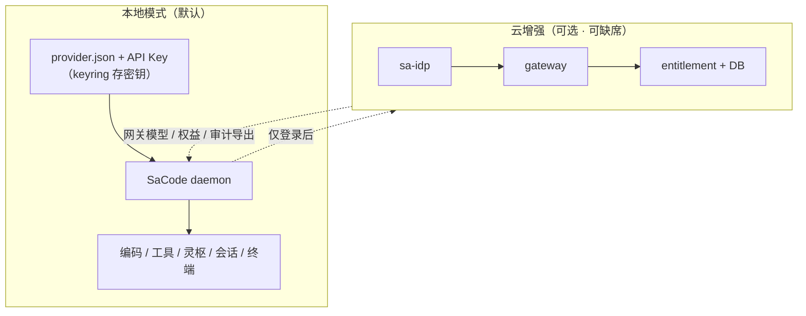

# Local Mode 产品原则与改造清单

> 状态：**v1.0 已定稿（2026-10-12 用户确认）**
> 日期：2026-10-12
> 诉求：自己用时不需要 sa-idp / gateway / entitlement / 数据库；配本地大模型即可完整工作。
> 相关：`docs/plans/desktop-interface-contract.md`（四组协作）· 灵枢架构（内核不动）

---

## 0. 一句话原则

**本地模式是默认且完整的；云身份/权益是可选增强，永不阻塞编码。**

---

## 1. 产品原则（硬约束）

| # | 原则 | 含义 |
| --- | --- | --- |
| P1 | **默认 Local Mode** | 全新安装不要求登录、不要求数据库、不要求三件套；配好本地模型即能跑任务 |
| P2 | **登录永非门槛** | 任何编码/工具/灵枢/会话功能不得因未登录而禁用 |
| P3 | **云能力显式可选** | 登录、权益、审计导出、Git OAuth 等是「点开才用」的增强，UI 明示依赖 |
| P4 | **License 只挡企业能力** | 核心功能永不锁；当前仅 `sacode_audit_export` 受门禁，保持此边界 |
| P5 | **无库自持** | Local Mode 状态存文件（`provider.json` / localStorage / OS keyring），不引入 DB |
| P6 | **密钥纪律不变** | API key 进 OS keyring / secret_ref，`provider.json` 永不落明文 |
| P7 | **云件套可整体缺席** | sa-idp / gateway / entitlement 进程完全不启动，产品不得报错刷屏；缺省表现为「云增强不可用」 |

---

## 2. 现状盘点（已成立 / 缺口）

### 2.1 已成立（不用重做）

| 项 | 证据 |
| --- | --- |
| 核心执行走本地 provider | `resolve_config_model_candidates` ← `.sacode/provider.json` |
| 本地模型增删改 | `createLocalProvider` / `listLocalProviders` / `deleteLocalProvider`，设置页「本地模型提供商」 |
| 登录非执行门槛 | 任务链路只问 provider，不问账号 |
| 密钥安全 | key 入 keyring，`provider.json` 只存 `secret_ref` |
| 离线 License 路径 | `SACODE_LICENSE_PUBLIC_KEYS`（企业能力，不挡核心） |
| UI 文案已有苗头 | 「可使用本地模型；登录后同步网关模型」 |

### 2.2 缺口（本轮改造）

| # | 缺口 | 影响 |
| --- | --- | --- |
| G1 | 无「本地模式」一等公民状态 | 账号页像「未完成」，不像「已选本地」 |
| G2 | 模型向导不够自助 | 新手不知道填什么 base_url / models / 是否思考 |
| G3 | 三件套不可用时体验差 | 可能报错/空列表刷屏，而非「云增强不可用」 |
| G4 | 账号页与服务地址混排 | 自用者被 IdP/entitlement 配置淹没 |
| G5 | Git OAuth 仍硬依赖 sa-idp | 自用者用 HTTPS+token 也该能工作 |
| G6 | 无产品原则成文 | 后续改动容易把登录又做成门槛 |

---

## 3. 目标形态

**状态机（账号页）：**

- `local`（默认）— 使用本地模型；提供「登录以启用云增强」
- `logging_in` / `online` — 已登录，可同步网关模型、查权益
- `cloud_degraded` — 配置了云地址但服务不可用；功能不减，仅云增强置灰

---

## 4. 改造清单（按归属，供派发）

### A. 产品与契约（先行，轻量）

| 项 | 内容 | 归属 |
| --- | --- | --- |
| A1 | 本文件定稿为产品原则 | 你确认 |
| A2 | 接口契约加 `GET /account/status` 响应扩展：`mode: 'local'\|'online'\|'cloud_degraded'`、`cloud_available: boolean` | Agent4 |
| A3 | 确认 P2/P4 写入 `docs/plans/desktop-layout-contract.md` 或 README 的「产品原则」段 | Agent1/文档 |

### B. Daemon / 接口（Agent4）

| 项 | 内容 | 验收 |
| --- | --- | --- |
| B1 | `GET /account/status` 返回 `mode` + `cloud_available`（探测 idp/gateway 可达性，超时短、失败不抛） | 三件套全停时返回 `local` 或 `cloud_degraded`，HTTP 200 |
| B2 | 权益/账号相关端点失败时返回结构化「云增强不可用」而非 5xx 堆栈 | 断网/未启动可测 |
| B3 | 任务执行路径零账号依赖审计：grep 确认无 `ensure_*_token` 在 task 主路径 | 单测 + 代码审查 |
| B4 | Git 凭据：无 sa-idp 时支持 token/SSH 方式（或明示仅 OAuth 需登录，不阻断 push/pull） | 文档 + 最小实现 |

### C. Desktop UI（Agent3 为主，Agent1 协调视觉）

| 项 | 内容 | 验收 |
| --- | --- | --- |
| C1 | 账号页顶部「模式横幅」：**本地模式** / **云增强已连接** / **云增强不可用** | 三态可见 |
| C2 | 未登录默认文案：「正在使用本地模型」+「登录以同步网关模型（可选）」 | 不像待办 |
| C3 | 服务地址配置（idp/gateway/entitlement）**折叠到「高级」**，默认不展开 | 自用者零干扰 |
| C4 | 云增强区（权益列表、审计导出、同步模型）在未登录/不可用时置灰 + 一行原因 | 不报错刷屏 |
| C5 | 设置 → 模型：「添加本地模型」向导（名称 / base_url / api_key / models 一行一个 / 是否思考 / reasoning_effort 默认） | 5 分钟内能配通 |

### D. 启动与默认值（Agent4 / Agent1）

| 项 | 内容 | 验收 |
| --- | --- | --- |
| D1 | 安装后零配置启动：daemon 起得来，Desktop 打开不弹登录 | 干净机器可测 |
| D2 | 无 `provider.json` 时引导到「添加本地模型」而非登录页 | 路径正确 |
| D3 | 三件套环境变量**不设也完全正常**（不写死 localhost:8080 等为必须） | 缺省即 local |

---

## 5. 明确不做（本轮）

- 不删除云能力代码（登录/权益/License 保留为可选）
- 不做账号体系的本地替代（本地模式 = 无账号，不是假账号）
- 不引入本地数据库
- 不做多用户/权限
- 厂家云端、遥测、浏览器扩展桥、WSL、临时会话、待办分组（沿用既有排除）

---

## 6. 验收口令

1. 干净机器：安装 → 启动 → 添加本地模型 → 跑任务，**全程无登录、无 DB、无三件套**。
2. 不设任何云相关 env，功能完整，UI 显示「本地模式」。
3. 三件套进程被杀，任务继续跑，UI 显示「云增强不可用」而非报错。
4. 登录（可选）后可同步网关模型、看权益；退出登录回到纯本地，不丢本地 provider。
5. 密钥不落明文（`provider.json` 抽查）。
6. 「已实现 / 已通过测试 / 已通过原生桌面验收」三列分别记录。

---

## 7. 派发建议

| 优先 | 项 | 说明 |
| --- | --- | --- |
| P0 | A1 你确认原则 | 定稿防跑偏 |
| P0 | B1/B2 + C1/C2/C4 | 状态可感 + 云不可用不吵 |
| P1 | C5 向导 + D1/D2/D3 | 「五分钟配通」体验 |
| P2 | B3/B4 + A2 契约字段收尾 | 审计与 Git 硬化 |

不建议新开第五个 agent：**B/D 并入 Agent4，C 并入 Agent3（视觉找 Agent1 协调）**，避免共享文件冲突。等当前四组收工后作为第二轮增量派发。
