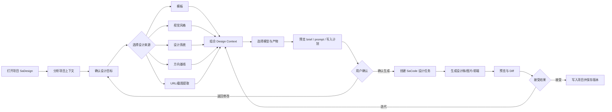
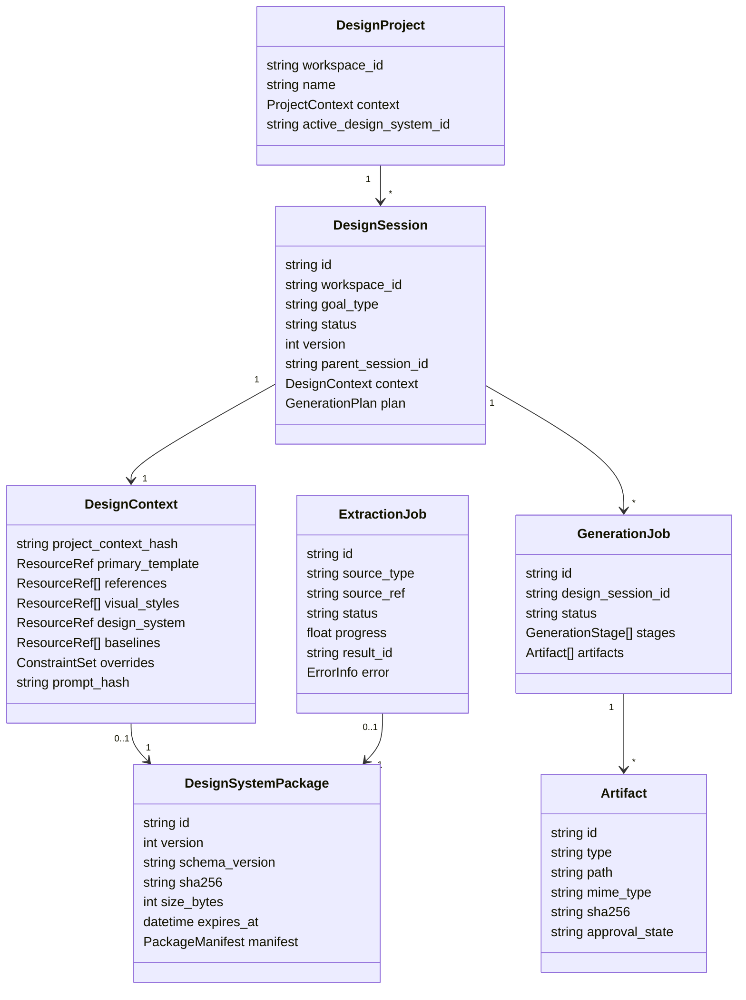
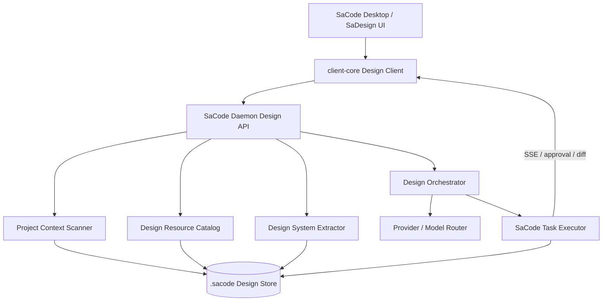

# SaDesign Desktop 产品需求文档

> 文档状态：方案草案，待评审  
> 文档版本：v0.1  
> 日期：2026-09-23  
> 适用产品：SaCode Desktop / Daemon / Runtime / CLI  
> 前置能力：[AIDesign（TD 示例库 + AI 设计变体）](../compose/spec/ai-design-tdesign.md)  
> 关联文档：[SaCode Desktop 与多 Agent 客户端 PRD](desktop-multi-agent-prd.md)

## 1. 决策摘要

1. **SaDesign 是 AIDesign 的产品化升级名称**。现有 AIDesign 的模板、简报、Prompt 与变体能力保留，作为 SaDesign 的基础能力和兼容入口。
2. SaDesign 是绑定当前工作区的项目级设计工作台，不是独立图片生成器。SaDesign 读取用户授权的项目背景，整理设计简报，组合模板、视觉风格、设计系统和方向基线，再交给用户选择的模型生成前端、设计稿或图片资产。
3. SaDesign 在 Desktop 增加一级入口，包含五个页面：`设计任务`、`模板`、`设计资源`、`设计系统提取`、`任务记录`。
4. 生成操作分成“预览计划”和“确认生成”两步。SaDesign 在用户确认前展示将使用的上下文、设计资源、模型、预计产物和目标路径。
5. 前端代码和项目文件修改继续走 SaCode Task Protocol、审批、Diff 和审计链路。SaDesign 不创建第二套不受控的文件写入机制。
6. 设计系统提取支持网页 URL、图片、代码目录和设计文件，输出可版本化、可预览、可下载、可复用的设计系统包。
7. 首期先实现项目理解、模板/资源选择、URL/图片提取、模型选择、设计简报与前端/图片生成闭环；Figma 双向同步和像素级自动还原延后。

## 2. 背景与问题

现有 AIDesign 已具备 5 个 TDesign 风格示例、AI 设计变体以及 `brief.md`、`prompt.md` 生成能力，但仅提供 CLI/TUI 入口，且能力止于设计简报，没有覆盖以下实际工作流：

- 用户在 SaCode 执行开发任务时临时需要页面设计、整套系统视觉或图片素材；
- 模型需要理解当前项目功能、技术栈、已有组件和品牌资产，而不是只接收一句生图提示词；
- 用户需要通过可视化模板进行选择，而不是记忆模板 ID；
- 用户需要从视觉风格、品牌设计系统和方向基线中组合设计约束；
- 用户需要参考在线网站或截图的风格，提取可复用设计系统；
- 用户需要选择模型和输出类型，并在生成前知道哪些文件会被创建或修改；
- 生成结果需要回到项目任务、Diff、审批和历史记录中继续迭代。

SaDesign 解决的是“项目上下文如何转化为可执行设计任务”的问题。

## 3. 产品定位

### 3.1 一句话定义

> SaDesign 是 SaCode 内面向当前项目的 AI 设计工作台，负责理解项目、组织设计上下文、选择视觉基线、编排模型，并生成可审查的设计稿、图片和前端实现。

### 3.2 SaDesign 与 AIDesign 的关系

| 名称 | 定位 | 状态 |
|---|---|---|
| AIDesign | 现有底层能力和 CLI/TUI 命令名，提供内置示例、设计变体、brief/prompt 落盘 | 已实现，继续兼容 |
| SaDesign | Desktop 产品名称及完整工作流，覆盖项目理解、资源浏览、设计系统提取、模型选择、生成、审查和历史 | 本 PRD 定义，待实施 |

命名策略：用户界面统一显示 `SaDesign`；代码模块迁移期可继续使用 `ai_design`，公开 API 使用 `/design/*`，避免一次性破坏 CLI 兼容性。

### 3.3 产品原则

1. **项目优先**：每个设计任务必须关联一个工作区和一份可确认的项目上下文摘要。
2. **选择优先**：模型生成前，用户能够选择或移除模板、视觉风格、设计系统和方向基线。
3. **来源可追踪**：每个生成结果记录上下文快照、资源版本、模型、Prompt 版本和目标路径。
4. **修改可审查**：代码和文件写入复用 SaCode 审批、Diff、审计与回滚能力。
5. **设计可复用**：提取和生成的设计系统能够在同一项目后续任务中再次使用。
6. **能力可降级**：只有文本模型时仍可生成 brief/prompt；缺少视觉或生图模型时禁用对应产物并解释原因。
7. **版权可感知**：复制风格不等于复制品牌标识或受版权保护内容，产品必须提示用户确认使用授权。

## 4. 目标与非目标

### 4.1 产品目标

- 用户从打开 SaDesign 到提交一个已配置的设计生成任务，常规路径不超过 5 个主要步骤。
- 用户能在生成前看见项目摘要、设计基线、模型、输出类型和写入位置。
- 生成的前端代码可直接进入现有 Changes/Diff/Approval 工作流。
- URL 或截图提取结果可形成完整的设计系统包，并支持版本、校验值、预览和下载。
- 同一个设计系统可以跨当前项目的多个 SaDesign 任务复用。

### 4.2 首期非目标

- 不提供完整 Figma 编辑器或替代专业设计工具；
- 不承诺对参考网站进行像素级复刻；
- 不自动复制第三方 Logo、商标、文案和图片；
- 不在未经审批时覆盖用户已有源代码或资产；
- 不提供云端团队素材市场、付费交易和公开分享；
- 不支持任意远程脚本执行或绕过 SaCode 沙箱抓取网站；
- 不在首期实现 Figma API 双向同步和多用户实时协作。

## 5. 用户与核心场景

### 5.1 目标用户

1. 使用 SaCode 构建 Web、Desktop 或移动应用，需要快速形成统一视觉的开发者；
2. 已有业务功能，但缺少 UI/UX 设计能力的独立开发者；
3. 需要让代码生成遵循团队品牌规范的产品与前端团队；
4. 需要从参考网站或截图提炼设计语言，而不是直接复制源码的用户。

### 5.2 核心场景

#### 场景 A：从模板生成当前项目页面

用户打开项目的 SaDesign，系统分析 README、路由、组件、主题和已有资产。用户选择一个模板，查看大图预览和适配说明，确认后选择模型与“前端实现”输出。SaDesign 生成设计计划，用户确认后创建 SaCode 任务，最终在 Diff 中审查代码。

#### 场景 B：为项目生成图片资产

用户描述需要 Hero 图、产品插图或空状态图。SaDesign 根据项目品牌、页面用途和选定视觉风格整理生图 Prompt，用户选择支持图像生成的模型、比例和数量。图片先写入任务产物区，用户确认后再复制到项目 assets 目录。

#### 场景 C：使用设计资源建立视觉方向

用户不选择完整模板，只从“视觉风格”“设计系统”“方向基线”中选择若干资源。SaDesign 展示冲突与覆盖关系，生成一个组合后的 Design Context，再用于设计稿或前端生成。

#### 场景 D：提取参考网站的设计系统

用户填写有权访问的网站 URL。SaDesign 创建提取任务，采集可公开访问的页面结构和视觉证据，输出颜色、字体、间距、组件、布局和图片 Prompt，并生成设计系统包。用户预览后将其保存到当前项目，再选择模型生成同风格但不复制品牌内容的页面。

#### 场景 E：从截图反推风格

用户上传网站截图。SaDesign 识别布局、色彩、排版、组件形态和图像风格，生成设计系统和同风格生图 Prompt。低置信度内容在结果中标记，用户可修改后使用。

## 6. 信息架构

Desktop 左侧图标轨增加 `SaDesign` 一级入口。进入后，顶部保留当前 Workspace 标识，页面内部使用以下导航：

1. **设计任务**：创建和继续当前项目的设计任务；
2. **模板**：浏览具象页面和系统模板；
3. **设计资源**：浏览视觉风格、设计系统和方向基线；
4. **设计系统提取**：从 URL、图片、代码或设计文件创建提取任务；
5. **任务记录**：查看生成任务和提取任务的状态、结果与失败原因。

资源分类首期按现有目录展示动态数量，示例为：

- 视觉风格（96）
- 设计系统（74）
- 方向基线（5）

数量由服务返回，客户端不得写死。

## 7. 端到端用户流程



### 7.1 从普通 SaCode 会话进入

当 SaCode Agent 判断任务需要 UI 设计、设计系统或图片资源时，Agent 可以发出 `design_suggestion` 事件。Desktop 在会话内显示“在 SaDesign 中继续”动作。用户点击后创建预填充草稿，但系统在用户确认前不得自动生成或写入文件。

### 7.2 从 SaDesign 主入口进入

SaDesign 默认打开最近草稿；没有草稿时显示“新建设计任务”和最近使用的模板/设计系统。用户可以跳过模板，直接以文本目标开始。

## 8. 功能需求

以下验收条件采用 EARS 表述，`SHALL` 表示必须满足。

### FR-1 项目上下文理解

**用户故事：** 作为开发者，我希望 SaDesign 理解当前项目，以便生成结果符合已有业务和技术约束。

1. WHEN 用户首次打开当前工作区的 SaDesign，系统 SHALL 创建项目上下文扫描任务。
2. 系统 SHALL 汇总项目名称、产品描述、目标用户、技术栈、路由、主要页面、组件库、主题配置和已有图片资产。
3. 系统 SHALL 显示每类上下文的数据来源和最后更新时间。
4. WHEN 用户取消某个上下文来源，系统 SHALL 从后续 Prompt 中排除该来源。
5. IF 文件不可读或扫描失败，系统 SHALL 显示失败文件和可继续使用的上下文范围。
6. 系统 SHALL 默认排除 `.git`、依赖缓存、构建产物、凭据文件和用户配置的敏感路径。

### FR-2 设计目标与输出类型

**用户故事：** 作为开发者，我希望明确要生成的内容，以便 SaDesign 选择正确模型和任务链路。

1. 系统 SHALL 支持 `整套系统`、`单个页面`、`组件`、`设计稿`、`图片资产`、`设计系统` 六种目标类型。
2. 系统 SHALL 支持多选 `设计简报`、`Prompt`、`可视化设计稿`、`前端代码`、`图片文件`、`设计系统包` 六种输出。
3. WHEN 用户选择前端代码，系统 SHALL 要求确认目标框架、目标目录和允许修改范围。
4. WHEN 用户选择图片文件，系统 SHALL 要求确认用途、比例、尺寸、数量、格式和候选目标目录。
5. IF 当前模型不支持某种输出，系统 SHALL 禁用该输出并显示可用模型。

### FR-3 模板浏览与选择

**用户故事：** 作为开发者，我希望通过视觉模板选择页面方向，以便减少纯文字沟通成本。

1. 系统 SHALL 以预览图、标题、适用场景、布局标签和技术适配信息展示模板。
2. 系统 SHALL 支持按关键词、页面类型、行业、布局、主题、颜色和技术栈筛选模板。
3. WHEN 用户打开模板，系统 SHALL 显示大图预览、模板描述、页面结构、主要组件、设计 Token 摘要和适配当前项目的说明。
4. WHEN 用户点击“使用此模板”，系统 SHALL 将模板版本加入当前 Design Context，并返回设计任务页。
5. 系统 SHALL 支持选择一个主模板和最多三个参考模板。
6. IF 多个模板包含冲突约束，系统 SHALL 要求用户选择主模板或手工解决冲突。

### FR-4 设计资源浏览

**用户故事：** 作为开发者，我希望组合视觉风格、品牌设计系统和方向基线，以便形成更精确的视觉约束。

1. 系统 SHALL 提供 `视觉风格`、`设计系统`、`方向基线` 三个资源分类。
2. 视觉风格 SHALL 描述色彩倾向、排版气质、图形语言、材质、光影和适用场景。
3. 设计系统 SHALL 提供 Token、组件规则、布局规则、资源文件和预览页面。
4. 方向基线 SHALL 提供跨项目通用的可访问性、响应式、信息密度、动效和内容层级约束。
5. WHEN 用户选择资源，系统 SHALL 显示该资源会覆盖或补充的 Design Context 字段。
6. 系统 SHALL 支持收藏、最近使用、当前项目已安装和本地导入筛选。
7. 系统 SHALL 记录资源 ID、版本、来源和使用许可说明。

### FR-5 Design Context 组合

**用户故事：** 作为开发者，我希望看到最终送给模型的设计依据，以便在生成前纠正冲突。

1. 系统 SHALL 将项目上下文、设计目标、模板、视觉风格、设计系统、方向基线和用户补充说明合成为 Design Context。
2. 系统 SHALL 按 `用户显式修改 > 当前项目设计系统 > 主模板 > 参考模板 > 视觉风格 > 方向基线 > 模型默认值` 的优先级解决约束。
3. IF 同优先级资源产生冲突，系统 SHALL 阻止确认生成并展示冲突字段。
4. 系统 SHALL 允许用户编辑颜色、字体、圆角、间距、布局密度、动效强度和图片风格等关键约束。
5. WHEN Design Context 发生变化，系统 SHALL 更新摘要和 Prompt 预览版本号。

### FR-6 设计系统提取输入

**用户故事：** 作为开发者，我希望从已有视觉来源提取设计系统，以便复用其设计语言。

1. 系统 SHALL 支持 `网页 URL`、`图片/截图`、`代码目录`、`设计文件` 四种输入类型。
2. WHEN 用户提交 URL，系统 SHALL 校验协议、可访问性和最终重定向目标。
3. WHEN 用户上传图片，系统 SHALL 支持 PNG、JPEG、WebP 和 GIF，并显示文件大小及分辨率。
4. WHEN 用户选择代码目录，系统 SHALL 在写入提取任务前显示将扫描的文件范围。
5. WHEN 用户提交输入，系统 SHALL 要求用户确认拥有分析和使用该来源的权利。
6. IF URL 指向本机、内网、云元数据地址或受阻地址，系统 SHALL 拒绝服务端抓取并返回安全错误。

### FR-7 设计系统提取处理

**用户故事：** 作为开发者，我希望看到提取过程和证据，以便判断结果是否可信。

1. 系统 SHALL 将提取任务状态表示为 `queued`、`scanning`、`analyzing`、`packaging`、`succeeded`、`failed`、`cancelled` 或 `expired`。
2. 系统 SHALL 展示任务 ID、输入摘要、创建时间、当前阶段和进度信息。
3. 系统 SHALL 提取颜色、字体、排版层级、间距、圆角、阴影、布局、断点、组件形态、图标和图片风格。
4. WHEN 输入包含截图，系统 SHALL 生成同风格图片 Prompt，并标记推断字段及置信度。
5. 系统 SHALL 保存来源证据和提取字段之间的关联。
6. IF 提取只完成部分内容，系统 SHALL 生成部分结果并列出缺失字段，而不是标记为完整成功。

### FR-8 设计系统包

**用户故事：** 作为开发者，我希望获得标准化设计系统包，以便下载、审查和再次使用。

1. 成功结果 SHALL 提供结果 ID、版本、包大小、到期时间、SHA-256 和清单元数据。
2. 设计系统包 SHALL 使用 `od-design-system-project/v1` 或后续兼容版本的清单结构。
3. 设计系统包 SHALL 至少包含 `DESIGN.md`、`tokens.css`、`design-tokens.json`、`components.html`、`USAGE.md` 和 `components.manifest.json`。
4. 设计系统包 SHALL 支持 `colors`、`typography`、`spacing`、`buttons`、`inputs` 和 `app` 预览页面。
5. WHEN 用户点击“保存到项目”，系统 SHALL 将包导入当前项目的 SaDesign 资源库并保留来源元数据。
6. WHEN 用户点击“下载 ZIP”，系统 SHALL 下载与显示 SHA-256 对应的不可变包版本。
7. IF 结果已过期，系统 SHALL 提供重新打包动作并保留原任务记录。

### FR-9 模型选择与能力匹配

**用户故事：** 作为开发者，我希望选择用于设计和生成的模型，以便控制质量、速度和成本。

1. 系统 SHALL 从当前 SaCode Provider 配置读取可用模型及其能力。
2. 系统 SHALL 区分文本推理、视觉理解、图片生成和代码生成能力。
3. 系统 SHALL 根据目标产物推荐模型组合，并允许用户手工替换。
4. WHEN 一个任务需要多种能力，系统 SHALL 展示阶段和每个阶段使用的模型。
5. 系统 SHALL 在确认前显示可获得的成本或用量估算；Provider 不提供估算时 SHALL 显示“未知”。
6. IF 模型在执行前变为不可用，系统 SHALL 暂停任务并允许用户更换模型后继续。

### FR-10 Prompt 编排与预览

**用户故事：** 作为开发者，我希望审查模型将收到的设计要求，以便发现错误上下文。

1. 系统 SHALL 基于 Design Context 生成结构化设计简报和阶段 Prompt。
2. 系统 SHALL 将 Prompt 分成项目事实、设计目标、视觉约束、输出规格、禁止事项和验收要求。
3. 系统 SHALL 显示 Prompt 使用的资源来源，但 SHALL 默认隐藏 Provider 密钥和敏感文件内容。
4. 系统 SHALL 允许用户追加说明，追加说明的优先级高于自动整理内容。
5. WHEN 用户确认生成，系统 SHALL 固化 Design Context 与 Prompt 快照并计算内容哈希。

### FR-11 生成任务

**用户故事：** 作为开发者，我希望在一个任务中生成设计稿、图片和代码，以便完成可运行的前端设计。

1. WHEN 用户确认生成，系统 SHALL 创建关联当前工作区的 SaDesign 任务。
2. 系统 SHALL 将任务拆分为 `context`、`brief`、`design`、`assets`、`code`、`verify` 阶段，并仅运行目标产物所需阶段。
3. WHEN 任务写入项目文件，系统 SHALL 通过 SaCode Task Protocol 触发审批和审计。
4. 系统 SHALL 将生成中的文本、工具调用、预览和错误实时投影到 Desktop。
5. WHEN 图片生成完成，系统 SHALL 先保存候选结果，再由用户选择写入项目的图片。
6. WHEN 前端生成完成，系统 SHALL 提供文件列表、Diff、运行验证结果和设计约束检查结果。
7. IF 任一阶段失败，系统 SHALL 保留已成功的阶段产物，并提供从失败阶段重试的动作。

### FR-12 结果审查与迭代

**用户故事：** 作为开发者，我希望比较结果并提出修改，以便逐步收敛到可用设计。

1. 系统 SHALL 支持桌面、平板和移动视口的设计稿或页面预览。
2. 系统 SHALL 支持在最多三个设计变体之间切换比较。
3. 系统 SHALL 显示每个变体与 Design Context 的差异摘要。
4. WHEN 用户接受代码结果，系统 SHALL 复用 Changes 面板完成最终审批。
5. WHEN 用户发起迭代，系统 SHALL 继承当前结果、Design Context 和用户批注，并创建新版本。
6. 系统 SHALL 保留版本谱系，用户能够识别每个版本的父版本。

### FR-13 任务记录

**用户故事：** 作为开发者，我希望查看生成和提取历史，以便恢复任务和复用结果。

1. 系统 SHALL 在任务记录中统一展示 `生成任务` 和 `提取任务`。
2. 系统 SHALL 支持按类型、状态、时间、模型和设计资源筛选。
3. 系统 SHALL 在详情页展示任务 ID、状态、输入、阶段、模型、产物、错误、创建时间和更新时间。
4. WHEN 用户重新打开 Desktop，系统 SHALL 从 daemon 恢复未完成任务和最近结果。
5. WHEN 用户删除任务记录，系统 SHALL 分别说明“仅删除记录”和“同时删除本地产物”的影响。

### FR-14 CLI 与现有 AIDesign 兼容

1. 现有 `sacode design list|show|variants|apply` 命令 SHALL 继续工作。
2. SaDesign 导入现有内置 TD 示例时 SHALL 保持模板 ID 稳定。
3. Desktop 创建的设计简报 SHALL 能被 CLI 查看和继续执行。
4. CLI 生成的兼容设计目录 SHALL 能被 Desktop 识别为历史设计资源。

## 9. 关键页面说明与线框图

线框图表达信息层级和交互位置，不代表最终视觉稿。最终 UI 应继续遵循 Desktop 现有 token 和四面板体系。

### 9.1 SaDesign 设计任务页

```text
┌──────┬──────────────────────────────────────────────────────────────┐
│ Rail │ SaDesign / 当前项目                      [任务记录] [设置]  │
│      ├───────────────┬──────────────────────────┬───────────────────┤
│  S   │ 设计输入      │ Design Context           │ 生成设置          │
│  +   │               │                          │                   │
│  ◇   │ 目标          │ 项目摘要                 │ 模型组合          │
│  ✦   │ ○ 整套系统    │ SaaS 管理后台 / React... │ 设计: Model A     │
│  ⚙   │ ● 单个页面    │ [查看来源] [重新扫描]    │ 图片: Model B     │
│      │ ○ 图片资产    │                          │ 代码: Model C     │
│      │               │ 主模板                   │                   │
│      │ 页面描述      │ ┌──────────────────────┐ │ 输出              │
│      │ [设置中心...] │ │ preview              │ │ ☑ 设计稿          │
│      │               │ │ Enterprise Settings  │ │ ☑ 前端代码        │
│      │ [选择模板]    │ └──────────────────────┘ │ ☐ 图片资产        │
│      │ [设计资源]    │                          │                   │
│      │ [提取设计系统]│ 视觉风格 / 设计系统      │ 目标目录          │
│      │               │ Clean Tech · Brand v2   │ src/pages/settings│
│      │ 补充要求      │                          │                   │
│      │ [............]│ [冲突 0] [编辑约束]      │ [预览计划]        │
│      │               │                          │ [确认并生成]      │
└──────┴───────────────┴──────────────────────────┴───────────────────┘
```

设计要点：

- 左侧定义“做什么”，中间解释“依据什么”，右侧确认“由谁生成、生成什么、写到哪里”；
- `确认并生成` 仅在无冲突、模型可用、目标路径合法时启用；
- 从 SaCode 会话进入时，目标和项目摘要由会话预填。

### 9.2 模板浏览与详情页

该页面采用参考图中的“背景模板墙 + 居中详情层 + 右侧操作栏”结构，但保留 SaCode Desktop 的视觉语言。

```text
┌─────────────────────────────────────────────────────────────────────┐
│ 模板  [搜索模板...]  [页面类型⌄] [行业⌄] [布局⌄] [主题⌄]          │
├─────────────────────────────────────────────────────────────────────┤
│ ┌──────────┐ ┌──────────┐ ┌──────────┐ ┌──────────┐                │
│ │preview   │ │preview   │ │preview   │ │preview   │                │
│ │Dashboard │ │Security  │ │Settings  │ │Landing   │                │
│ └──────────┘ └──────────┘ └──────────┘ └──────────┘                │
│                                                                     │
│       ┌───────────────────────────────────────────────┐             │
│       │ 模板名称                              [×]    │             │
│       ├──────────────────────────────┬────────────────┤             │
│       │                              │ 当前项目适配   │             │
│       │      大图 / 多视口预览       │ 高             │             │
│       │                              │                │             │
│       │                              │ 页面结构       │             │
│       │                              │ Header         │             │
│       │                              │ Metrics        │             │
│       │                              │ Data table     │             │
│       │                              │                │             │
│       │ [Desktop] [Tablet] [Mobile]  │ [使用此模板]   │             │
│       └──────────────────────────────┴────────────────┘             │
└─────────────────────────────────────────────────────────────────────┘
```

详情右栏还需显示版本、来源、适用技术栈、设计 Token 摘要、许可说明以及“设为主模板/加入参考”的差异。

### 9.3 设计资源页

```text
┌─────────────────────────────────────────────────────────────────────┐
│ 设计资源                                                            │
│ [视觉风格 96] [设计系统 74] [方向基线 5]                            │
│ [搜索...] [收藏] [最近使用] [当前项目] [本地导入]                   │
├────────────────────┬────────────────────────────────────────────────┤
│ 筛选               │ ┌──────────┐ ┌──────────┐ ┌──────────┐       │
│ 色彩 ○亮 ○暗       │ │视觉样本  │ │视觉样本  │ │视觉样本  │       │
│ 密度 ○疏 ○密       │ │Swiss Grid│ │Soft Glass│ │Editorial │       │
│ 行业 ...           │ │色板/字体 │ │色板/字体 │ │色板/字体 │       │
│ 技术栈 ...         │ │[预览][+] │ │[预览][+] │ │[预览][+] │       │
│                    │ └──────────┘ └──────────┘ └──────────┘       │
│ 已选资源           │                                                │
│ 主设计系统 Brand v2│ 选择资源后展示覆盖字段与冲突提示                │
│ 风格 Clean Tech    │                                                │
│ 基线 Accessible UI │                                                │
└────────────────────┴────────────────────────────────────────────────┘
```

### 9.4 设计系统提取页

```text
┌─────────────────────────────────────────────────────────────────────┐
│ 设计系统提取                         [新建提取] [任务记录]          │
├─────────────────────────────────────────────────────────────────────┤
│ 输入来源  [网页 URL] [图片] [代码目录] [设计文件]                   │
│ URL  [https://example.com................................] [分析]   │
│ ☑ 我确认拥有分析和使用该来源的权利                                 │
├──────────────────────┬──────────────────────────────────────────────┤
│ 当前任务             │ 提取结果                                    │
│ e8c783b1-...         │ 已成功  设计系统包已生成                     │
│                      │                                              │
│ ● 提取成功           │ 结果 ID   9e5dc1be-...                       │
│                      │ 版本      1                                  │
│ 扫描        ✓        │ 包大小    72.2 KiB                           │
│ 分析        ✓        │ 到期时间  2026/10/23 00:50                   │
│ 打包        ✓        │ SHA-256   d887d9c7...                        │
│                      │                                              │
│                      │ [预览设计系统] [保存到项目] [下载 ZIP]       │
│                      │                                              │
│                      │ 清单元数据                                   │
│                      │ { schemaVersion, source, files, preview... } │
└──────────────────────┴──────────────────────────────────────────────┘
```

详情页将“业务可读摘要”置于 JSON 清单之前；JSON 默认折叠，供高级用户诊断和复制。

## 10. 领域模型



### 10.1 建议落盘结构

兼容现有 `.sacode/design/<id>` 约定，将每个 Design Session 作为一个设计 ID：

```text
.sacode/design/<design-session-id>/
├── manifest.json
├── brief.md
├── prompt.md
├── context/
│   ├── project-summary.md
│   ├── context.json
│   └── sources.json
├── resources/
│   └── lock.json
├── variants/
│   └── variant-1/
├── artifacts/
│   ├── previews/
│   ├── images/
│   └── reports/
└── versions/
    └── 1.json

.sacode/design-systems/<design-system-id>/<version>/
├── manifest.json
├── DESIGN.md
├── tokens.css
├── design-tokens.json
├── components.html
├── components.manifest.json
├── USAGE.md
├── brand.json
├── assets/
├── preview/
└── source/
```

项目内只保存长期需要的元数据和已接受产物。可重新下载的大型临时候选图进入 SaCode 缓存目录，并通过 manifest 引用。

## 11. 设计系统包清单

SaDesign 接受用户给出的 `od-design-system-project/v1` 格式，并增加兼容性校验。核心字段如下：

```json
{
  "schemaVersion": "od-design-system-project/v1",
  "id": "design-system-id",
  "name": "Design System Name",
  "category": "Imported",
  "description": "来源与用途说明",
  "source": {
    "type": "url",
    "url": "https://example.com",
    "mode": "standard",
    "importedAt": "2026-09-23T00:00:00Z"
  },
  "files": {
    "design": "DESIGN.md",
    "tokens": "tokens.css",
    "designTokens": "design-tokens.json",
    "tailwind": "tailwind-v4.css",
    "components": "components.html"
  },
  "usage": "USAGE.md",
  "componentsManifest": "components.manifest.json",
  "importMode": "hybrid",
  "assetsDir": "assets",
  "brand": "brand.json"
}
```

校验规则：

- `schemaVersion`、`id`、`name`、`source` 和 `files` 为必填；
- 包内路径必须为相对路径，解压后不得越过包根目录；
- 下载结果的 SHA-256 必须与任务详情一致；
- 未识别字段保留，保证前向兼容；
- 外部 HTML 预览默认在受限环境打开，不执行来源脚本；
- 包版本不可变，修改后生成新版本。

## 12. 系统架构与职责



### 12.1 Desktop

- 负责页面状态、浏览筛选、选择确认、进度展示、结果比较和用户输入；
- 不直接持有 Provider 密钥；
- 不直接跨域抓取参考 URL；
- 通过 Tauri IPC transport 调用 daemon，沿用当前 token 边界。

### 12.2 client-core

- 增加 Design API 类型、运行时校验、任务状态和 SSE 事件类型；
- Desktop 与未来 VSCode SaDesign 入口复用相同协议；
- 不承载模型调用和文件扫描逻辑。

### 12.3 Daemon / Runtime

- 扫描工作区并生成项目上下文；
- 管理资源目录、提取任务、Design Session 与产物；
- 验证模型能力并编排多阶段任务；
- 将代码生成阶段交给现有 Agent Backend；
- 将写入、审批、取消、恢复和审计投影为现有 Task Protocol。

### 12.4 外部设计资源服务

资源目录和提取能力可以由本地能力或受信任远程服务提供。协议必须隐藏具体供应商实现，Desktop 只消费标准 `DesignResource`、`ExtractionJob` 和 `DesignSystemPackage`。

## 13. API 草案

统一前缀建议为 `/api/design`：

| 方法 | 路径 | 用途 |
|---|---|---|
| `GET` | `/api/design/context` | 获取当前工作区项目上下文 |
| `POST` | `/api/design/context/scan` | 重新扫描并返回任务 ID |
| `GET` | `/api/design/resources` | 查询模板和设计资源 |
| `GET` | `/api/design/resources/:id` | 获取资源详情和版本 |
| `POST` | `/api/design/extractions` | 创建提取任务 |
| `GET` | `/api/design/extractions` | 查询提取任务记录 |
| `GET` | `/api/design/extractions/:id` | 获取任务状态和结果 |
| `POST` | `/api/design/extractions/:id/cancel` | 取消提取任务 |
| `POST` | `/api/design/systems/:id/import` | 保存设计系统到当前项目 |
| `GET` | `/api/design/systems/:id/versions/:version/download` | 下载不可变 ZIP |
| `POST` | `/api/design/sessions` | 创建设计草稿 |
| `PATCH` | `/api/design/sessions/:id` | 更新目标和 Design Context |
| `POST` | `/api/design/sessions/:id/plan` | 生成 brief、Prompt 与写入计划 |
| `POST` | `/api/design/sessions/:id/generate` | 确认并开始生成 |
| `GET` | `/api/design/jobs/:id` | 获取生成任务状态 |
| `POST` | `/api/design/jobs/:id/cancel` | 取消生成任务 |
| `POST` | `/api/design/jobs/:id/retry` | 从失败阶段重试 |

SSE 继续复用现有事件流，新增可向后兼容的事件：

- `design_context_updated`
- `design_extraction_progress`
- `design_plan_ready`
- `design_generation_stage`
- `design_preview_ready`
- `design_artifact_ready`
- `design_job_completed`
- `design_job_failed`

## 14. 状态机

### 14.1 Design Session

```text
draft → analyzing → ready → planning → planned → generating → review → accepted
  │         │          │         │          │            │
  └─────────┴──────────┴─────────┴──────────┴────────────┴→ failed
                                                       └──→ cancelled
review → generating  （基于批注创建新版本）
```

### 14.2 Extraction Job

```text
queued → scanning → analyzing → packaging → succeeded
   │         │           │           │
   └─────────┴───────────┴───────────┴→ failed
   └──────────────────────────────────→ cancelled
succeeded → expired → packaging
```

状态变化由 daemon 持久化；Desktop 刷新或重连后必须从服务端恢复，不依赖前端内存推断。

## 15. 安全、隐私与版权

1. 项目扫描遵循显式工作区边界、忽略规则和敏感文件排除规则；
2. 用户可在发送模型前查看上下文来源，并排除文件；
3. Provider 密钥只存在于现有安全配置边界，不写入 Design Session；
4. URL 提取必须防止 SSRF、重定向绕过、私网访问和超大响应；
5. 图片和文件上传前显示目标服务和用途；远程处理必须获得用户确认；
6. HTML 预览使用受限 iframe/WebView，不授予本地文件、网络和 Tauri API 权限；
7. ZIP 解压验证路径、文件数、单文件大小、总大小、扩展名和 SHA-256；
8. 参考网站提取结果默认移除 Logo、商标、文案和原站图片，只保留抽象设计语言；
9. 任务记录保存来源 URL 和许可确认时间，便于审计；
10. 删除本地产物、覆盖项目文件、发布或上传内容等高影响操作继续要求用户确认。

## 16. 错误处理

| 场景 | 用户反馈 | 恢复动作 |
|---|---|---|
| 项目扫描部分失败 | 显示失败来源和可用摘要 | 排除文件、授权后重扫 |
| 资源目录不可用 | 展示本地资源和缓存时间 | 重试或离线继续 |
| URL 不可访问 | 显示 DNS、状态码或权限原因 | 修改 URL、改用截图 |
| URL 被安全策略拒绝 | 显示被拒绝的地址类型 | 使用公开 URL 或本地截图 |
| 提取部分成功 | 标记缺失字段和低置信度字段 | 手工编辑后保存 |
| 模型能力不匹配 | 禁用对应输出 | 更换模型或减少输出 |
| 模型中途失败 | 保留成功阶段产物 | 从失败阶段重试 |
| 代码生成验证失败 | 显示命令和错误摘要 | 交给 SaCode 修复或保留草稿 |
| 目标文件冲突 | 显示现有文件和 Diff | 换目录、逐文件审批 |
| 下载包已过期 | 保留清单但禁用旧下载 | 重新打包 |
| 校验值不一致 | 阻止导入 | 重新下载并报告错误 |

## 17. 非功能需求

### 17.1 性能

- 已缓存资源目录首屏应在 1 秒内可交互；
- 项目上下文扫描必须流式显示阶段，不阻塞 Desktop 主线程；
- 模板预览使用缩略图和懒加载，大图只在详情打开后加载；
- 单个 Design Session 的 SSE 重连沿用 `Last-Event-ID`，不得重复展示已确认产物。

### 17.2 可访问性

- 所有模板、资源和模型选择均可通过键盘操作；
- 预览图必须提供可读标题和结构摘要，不能只依赖颜色；
- 状态不得只使用颜色表达；
- 弹层打开后焦点进入详情，关闭后回到原模板卡片；
- 图片生成结果支持替代文本草稿。

### 17.3 可观测性

- 记录设计任务各阶段耗时、模型、失败码和重试次数；
- 记录设计资源命中、模板选择和产物接受率，但不上传项目源码；
- 每个生成产物可关联到 Design Session、Prompt hash 和模型响应 ID；
- 日志必须脱敏 URL 查询参数、Token、Provider 密钥和项目敏感路径。

## 18. 成功指标

首期发布后使用以下指标评估：

- SaDesign 草稿到确认生成的完成率；
- 模板/设计资源选择后的生成启动率；
- 生成任务成功率和分阶段失败率；
- 首次结果接受率与平均迭代次数；
- 生成代码进入项目后的审批接受率；
- 提取任务成功率、部分成功率和平均完成时间；
- 设计系统在同一项目中的二次使用率；
- 因上下文错误、模型能力不匹配或文件冲突导致的失败占比。

指标不以“生成次数”单独衡量成功，重点关注结果是否被接受并进入项目。

## 19. 实施阶段

### M0：协议和现有能力归并

- 确认 SaDesign 命名与 AIDesign 兼容策略；
- 定义 Design Context、Design Session、Artifact 和 Design Resource 类型；
- 固化设计系统包 schema、状态机和 API；
- 将现有 5 个 TD 示例映射为模板资源。

### M1：Desktop 项目理解与模板闭环

- Desktop 增加 SaDesign 一级入口；
- 项目上下文扫描与可编辑摘要；
- 模板目录、详情弹层和使用确认；
- 复用现有 AIDesign 生成 brief/prompt；
- Design Session 与任务记录持久化。

### M2：设计资源与模型生成

- 视觉风格、设计系统、方向基线目录；
- Design Context 合并与冲突处理；
- 模型能力选择和阶段计划；
- 设计稿、前端代码和图片生成；
- 结果比较、Diff、审批和版本迭代。

### M3：设计系统提取

- URL 和图片提取；
- 代码目录和设计文件导入；
- 包预览、校验、下载和保存到项目；
- 来源证据、置信度、版权确认和安全门禁。

### M4：质量与生态

- 多视口视觉验证和可访问性检查；
- 模板与资源版本更新策略；
- VSCode 入口和更完整 CLI；
- 评估 Figma 导入/导出与团队资源库。

## 20. 首期验收门禁

1. 用户可以从 Desktop 当前项目进入 SaDesign 并完成项目上下文扫描；
2. 用户可以浏览模板、打开详情并将一个模板加入当前设计任务；
3. 用户可以分别选择视觉风格、设计系统和方向基线，并看到冲突提示；
4. 用户可以选择模型和输出类型，并在确认前查看 brief、Prompt 摘要和写入计划；
5. 用户可以生成至少一种前端结果和一种图片结果；
6. 前端写入经过现有审批、Diff 和审计链路；
7. 用户可以从公开 URL 或截图创建提取任务，并获得符合 schema 的设计系统包；
8. 提取详情展示结果 ID、版本、包大小、到期时间、SHA-256 和清单；
9. 用户可以预览、下载并保存设计系统到当前项目；
10. Desktop 重启后能够恢复任务记录、未完成任务和已安装设计系统；
11. 现有 `sacode design` CLI 和 TUI 行为不回退；
12. URL 提取、ZIP 导入、敏感文件扫描和项目写入通过安全测试。

## 21. 待产品评审项

以下项目不阻塞本 PRD 形成，但必须在 M0 冻结：

1. 视觉风格 96、设计系统 74、方向基线 5 的目录是远程服务、内置快照还是混合来源；
2. 设计系统包 `od-design-system-project/v1` 是否由 SaCode 直接长期采用，或增加 SaCode 自有兼容层；
3. 可视化设计稿首期采用静态图片、HTML Preview，还是两者都支持；
4. 图片生成 Provider 的首批支持范围、计费提示和内容安全策略；
5. 远程提取服务的数据保留时间、下载有效期和删除机制；
6. 项目上下文发送给远程模型时的默认文件范围和组织级策略。

## 22. 参考实现映射

| 已有能力 | SaDesign 复用方式 |
|---|---|
| `runtime/src/ai_design` | 内置模板、brief/prompt 和变体生成基础 |
| `sacode design` / TUI `/design` | CLI 兼容入口与无 GUI 降级路径 |
| Desktop 四面板 UI | SaDesign 详情、任务流和 Changes 审查的基础布局 |
| client-core | Design API、状态恢复和 SSE 的共享客户端层 |
| daemon Task Protocol | 代码生成、审批、取消、恢复和审计 |
| Provider 与模型路由 | 文本、视觉、图片和代码模型的能力选择 |
| `media.vision` | 截图理解和设计证据提取的本地能力入口 |

---

本 PRD 将 SaDesign 定义为现有 AIDesign 的连续演进，而不是平行实现。实现时应优先扩展 runtime 和 daemon 的统一设计领域模型，再由 Desktop 提供完整交互，避免模板、提取和生成分别形成孤立的数据与任务体系。
